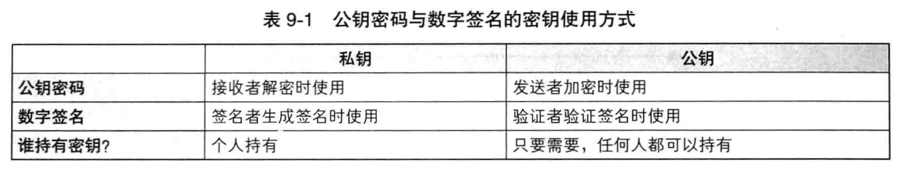

[toc]

# 1. 数字签名
## 1.1. 消息认证码到数字签名
消息认证码：**保护消息完整性**、**对消息进行认证**、**无法防否认**

为什么消息认证码无法防否认？
```
消息认证码在发送者和接收者之间共享同一个密钥，对于第三方而言，无法证明该消息是由发送者还是接收者生成的。
```

为什么数字签名可以防否认？
```
生成签名和验签这两个行为，使用各自专用的密钥来完成。
```

公钥和私钥使用方式及持有者：


## 1.2. 数字签名的方法
1. 直接对消息签名
2. 对消息的散列值签名