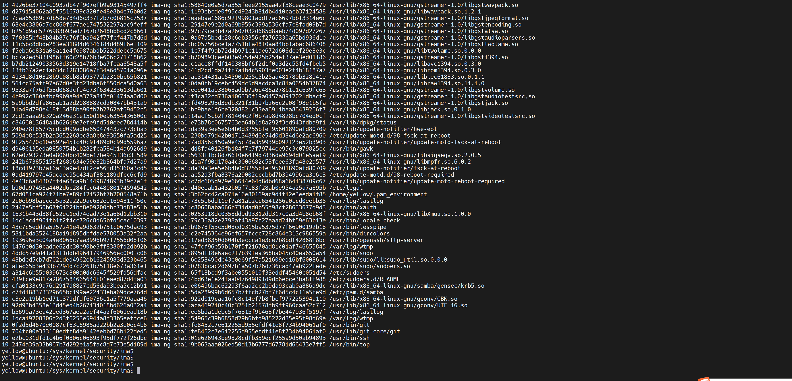
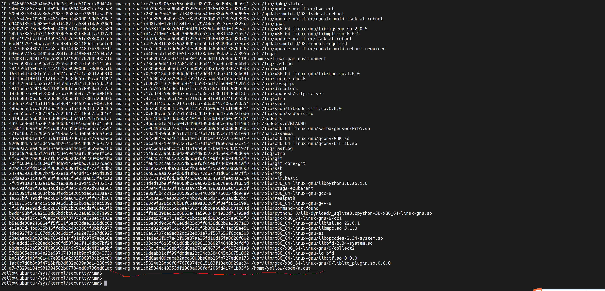

# ubuntu上验证内核ima
参考
https://blog.csdn.net/hsluoyc/article/details/46046275

# 查看内核默认度量值
打开内核ima后，查看信息如下：
```
cat /sys/kernel/security/ima/ascii_runtime_measurements
```


# 用户应用程序度量
编写任意C应用程序后运行，发现程序出现在度量值最后一行，可见运行程序后会导致IMA度量值变化。

