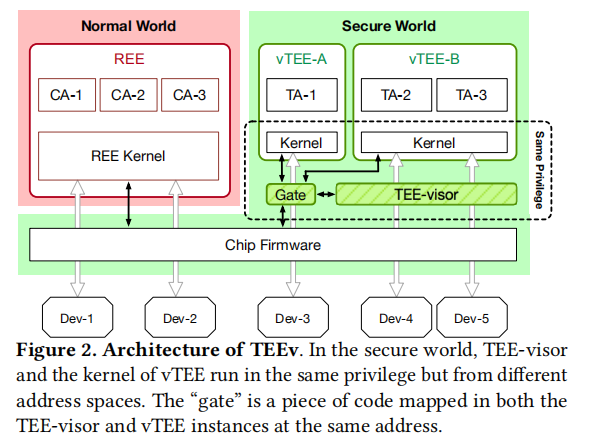
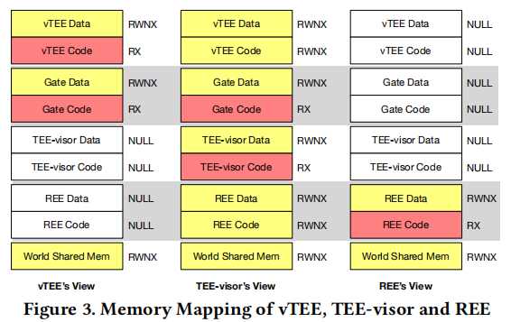

[toc]

# 1. 背景
## 1.1. TEE发展趋势
TEE 逐渐从由 vendor 控制的单 TEE 模式，过渡为 open TEE 模式（不同的 TA 有不同的来源，实现各自不同的目的）。

## 1.2. open TEE的安全挑战
1. TA 和 TEE 的复杂性增加，导致攻击面扩大
2. TA 和 TEE 之间缺乏信任（隔离）

## 1.3. TEE所面临的安全风险
1. TEE 漏洞会导致私密数据泄露或者任意代码执行（CVE-2017-0518/0519, CVE-2016-2431/2432）
2. TEE 漏洞会导致一个 TA 影响到其它 TA 的安全（CVE-2016-0825, CVE-2015-6639/6647）
3. TEE 漏洞可以被利用来实现 REE 提权（ CVE-2016-8762/8763/8764）

# 2. System Overview
## 2.1. TEEv的提出
TEEv 是一个 TEE 虚拟化架构，支持多个隔离的、受限制的 TEE 实例并行运行。

依靠一个小的 hypervisor（TEE-visor），TEEv 允许来自不同供应商的 TEE 实例在同一台智能手机上独立运行，并托管它们自己的 TA。因此，受攻击的 vTEE 不会影响其它 vTEE 和 REE，TA 不需要在不可信的 TEE 中运行。

## 2.2. 实现TEEv面临的挑战
1. secure world 侧不支持硬件虚拟化（Armv8.4增加），需要将 TEE-visor 和 vTEE 运行在同一个特权级别，同时保持它们间的隔离
2. 虚拟化需要对 REE 应用和 TA 完全透明
3. 需要复用不同的外设来支持不同的 TA（指纹、framebuffer），而这些外设设计往往并没有考虑复用
4. 需要最小化对现有 TEE 的修改，同时减少虚拟化负载开销

## 2.3. TEEv架构的优势
* isolation（隔离）：
TEE-visor 架构增强了两方面的隔离：TEE 间的隔离、vTEE 和 REE间的隔离。
即便一个 vTEE 有漏洞，它也不会影响到其它 vTEE（本地化 TEE 攻击，防止其突破整个系统）。

* restricted interaction（受限制的交互方式）：
TEE-visor 通过要求使用指定的通信通道、接口和语义来限制不同执行环境之间的交互。

* multiple vTEEs（多vTEE）：
通过支持多 vTEE，TA 可以选择自己信任的 TEE 实例，而不是选择相信默认的 TEE。

## 2.4. 威胁模型和假设
假设：
1. 启动流程受硬件保护，TEE-visor 启动后不会受影响
2. vTEE 不信任其它 vTEE，从 vTEE 视角来看，其它 vTEE 可能受攻击者控制或存在漏洞
3. 每个 vTEE 内部，内核不信任 TA，TA 之间互相不信任
4. vTEE 只信任 system-vTEE 提供的部分服务，而不是 system-vTEE 整体
5. REE 只信任 vTEE 提供的部分服务（信任只存在于应用程序级别，而不是系统级），如果 vTEE 是恶意的，它无法访问 REE 的数据，只有依赖于该 vTEE 服务的 REE 应用才会受到影响

不考虑：
1. 不考虑 vTEE 间或 REE 和 vTEE 间的**物理攻击**
2. 不考虑 app 内部的逻辑 bug
3. 不考虑**侧信道攻击**（某些侧信道攻击会打破 TrustZone 的隔离机制）

## 2.5. 面临的技术挑战
1. 不支持硬件虚拟化
secure world 侧不支持硬件虚拟化（Armv8.4增加），TEE 内核需要运行在最高特权级别来控制所有计算资源。
需要一种方法来保证 vTEE 和 TEE-visor 间的隔离，同时为每个 vTEE 设置限制。

2. 兼容性
我们的系统需要与大部分设备兼容，不同的设备有各自不同的**外设**和驱动。

3. 小的 TCB（Trusted Computing Base）
系统的 TCB 需要尽可能的小，TEE-visor 应当仅包含必要的功能以最小化攻击面。

4. 易于部署
它应当不会干扰现有系统，不需要对现有的 TEE 进行大幅修改，也不会导致显著的性能开销。

## 2.6. TEEv Overview

TEEv 系统包括三部分：
1. TEE-visor ，作为 hypervisor 管理和保证多个 vTEE 的安全性
2. 一个门机制，用于实现不同执行环境和 TEE-visor 的安全上下文切换
3. 一个安全通信通道机制，用于不同执行环境的安全交互

**TEE-visor** 负责安全世界的资源管理，它控制 **vTEE 的调度**、**内存映射**、**外设分配**。它还管理第三方 **vTEE 实例**的**安装、更新和删除**。TEE-visor 和 vTEE 运行在同一特权级别，但是它和其它环境**隔离**保证安全性。

REE 和 vTEE 间的交互，只允许通过 TEE-visor 建立的**安全通信通道**实现。**vTEE** 和 **REE** 可以给 TEE-visor 发送请求来建立安全通道，请求包括**两个环境的标识**以及来自请求者的用于**共享**的分配的 **memory page** 。对这样的请求， TEE-visor 首先**验证环境标识**，然后调整每个环境的 **page table** 完成共享内存的映射。TEE-visor 提供定义良好的 vTEE/REE 接口来操作安全通道，包括创建/删除，attach/detach memory page。

存在一个**system-vTEE**，它包括：
* 一个 **TEE OS**，包含指纹读取器等**外设驱动**
* 部分 **common TA**，例如 Android 中需要的 Keymaster TA 和 GateKeeper TA。
system-vTEE 是**预装**和**受限制的**，它不允许动态加载新的 TA。
REE 侧的 app 可以请求 TEE-visor 加载新的第三方 vTEE，vTEE 只有在收到其它环境或设备的服务请求时才会激活。

# 3. Design
## 3.1. Isolation Enforcement
### 3.1.1. TEE-visor 和 vTEE 间的隔离
#### 3.1.1.1. TEE hypervisor
增加一个小的 TEE hypervisor（TEE-visor），运行在**最高特权级别（仍然是Secure EL1）**，保持对**MMU**的**独占**控制。每次 REE 中的 CA (客户端应用程序)需要与 TEE 中的 TA 通信时，**CA** 都会向 TEE-visor **发送一个请求**，TEE-visor 依次**授权 TA 访问**一个或多个 CA 的**内存页面**。

#### 3.1.1.2. 如何保证只有 TEE-visor 才可以配置 MMU
对**有关指令**进行**保护**，**vTEE不允许**使用这些指令，包括：
* SCTLR（system control register）
* TBR(translation table base register)
* VBAR (vector base register)
* DACR(domain access control register)
* TLB flush register
* MMU enable/disable register

通过**扫描 vTEE 二进制**，确保在**安装**或**加载**时，不包含此类指令。
由于 vTEE 被剥夺了配置 MMU 的权限，只有 TEE-visor 才可以获得对页表的**完全**和**排他**控制权，因此，TEE-visor 可以保护自身**代码和数据**的**完整性**和**私密性**。
除此之外，通过利用对 MMU 和外设的控制，TEE-visor 也隔离了 vTEE 并实现了**入口保护**。

### 3.1.2. vTEE 和其它 vTEE/REE 间的隔离
**TEE-visor** 是整个**系统的可信基**，它**可以访问所有物理内存**。启动时，TEE-visor 将识别和管理每个内存的使用权限以便进一步管理内存。

TEE-visor 将每一个 **vTEE** 限制在**自己的内存视图**中。没有明确的认证，vTEE 只能访问自己的 **data** 和 **code** 段，不能访问分配给 **其它 vTEE**、**REE**或 **TEE-visor** 的内存空间。

如下是 vTEE、REE、TEE-visor 各自的内存视图，这种设计确保 vTEE 不具有比 REE 更高的特权，从而在 vTEE 和 REE 之间建立相互不信任连接。

### 3.1.3. vTEE 内核生命周期代码完整性保护
确保每个**vTEE内核生命周期代码完整性**对于 TEEv 至关重要，否则攻击者可能会通过利用一个 vTEE 并在 vTEE 中**注入代码**来**破坏**我们的**隔离**保证，从而导致在与**TEE-visor相同特权级别**中执行任意特权代码。

由于**TEE-visor 控制所有 vTEE 的页表**，因此 TEE-visor 强制将所有 vTEE 内核代码段映射为**只读**。

除了 vTEE 内核代码段之外，vTEE 映射的所有其他页都设置为从不特权执行(PXN),

## 3.2. Gate for Context Switching